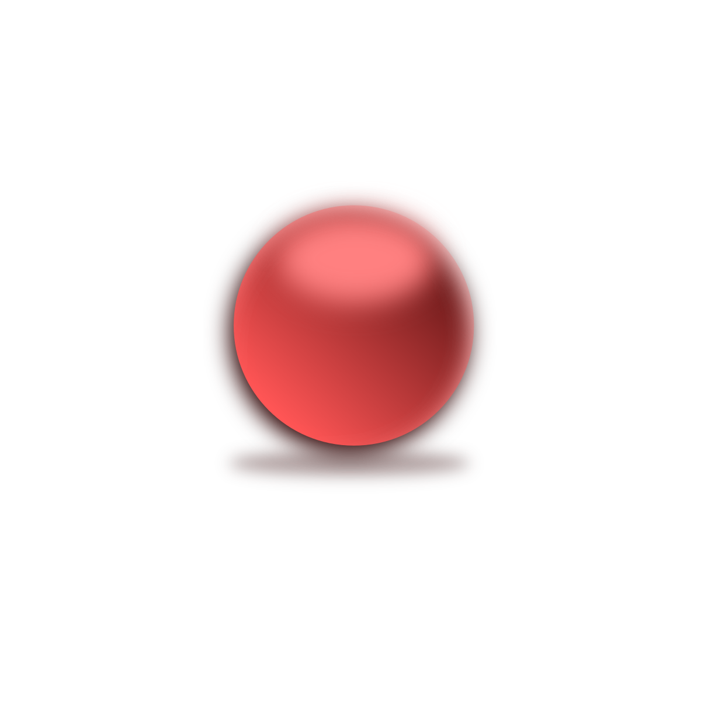

# Purpose

<!--
The comments below are from the Flutter/Dart package generation. Feel free to use or ignore
-->

<!--
This README describes the package. If you publish this package to pub.dev,
this README's contents appear on the landing page for your package.

For information about how to write a good package README, see the guide for
[writing package pages](https://dart.dev/guides/libraries/writing-package-pages).

For general information about developing packages, see the Dart guide for
[creating packages](https://dart.dev/guides/libraries/create-library-packages)
and the Flutter guide for
[developing packages and plugins](https://flutter.dev/developing-packages).
-->

Draws an MacOS-X old-style aqua sphere:{: width="100px" height="100px"}

## Features

- Control on materialColor (required)
- Control on radius (Default: 10.0 pixels)

## Getting started

In pubspec.yaml file

```yaml
dev_dependencies:
  ui_aqua_button_flutter:
    git: https://github.com/GitHubStuff/ui_aqua_button_flutter.git
```

## Usage

Full demo in /example folder

```dart
Container(
    child: AquaButton(materialColor: Colors.blue),
);
```

Example Constructor:

```dart
const AquaButton({
    super.key,
    required this.materialColor,
    this.radius = 10.0,
  });
```

## Additional information

Source code at [GitHub](https://github.com/GitHubStuff/ui_aqua_button_flutter)

## Finally

Be kind to each other
